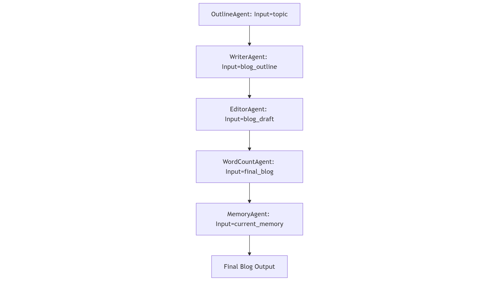

#  Agents Intensive - Capstone Project: Blog Writer-AI (Agent for good)

## Category 1: 
### The Pitch (Problem, Solution, Value):
#### Problem:
Writing high-quality blog content involves multiple complex steps—outlining, drafting, editing, and reviewing—which can be time-consuming and difficult to manage efficiently.

#### Solution:
This project automates the entire blog creation process by using specialized AI agents working in a pipeline. The OutlineAgent creates the blog structure from a topic, the WriterAgent drafts the content, the EditorAgent refines the draft, the WordCountAgent ensures the length is appropriate, and the MemoryAgent updates contextual memory to improve future outputs.

#### Value:
By streamlining these stages with AI, the project significantly reduces the time and effort needed to produce polished blog posts, ensuring consistent quality and allowing users to focus on higher-level tasks or scale content production effortlessly.

### Core Concept & Value

The central idea of this project is to leverage a modular AI agent-based pipeline to fully automate the creation of high-quality blog content. Each agent has a specific, meaningful role: the OutlineAgent structures the blog, the WriterAgent generates the initial draft, the EditorAgent refines the content, the WordCountAgent validates length, and the MemoryAgent updates project memory for continuity and improvement.

This approach is highly relevant to the track as it demonstrates innovation in workflow automation using AI agents, turning a multi-step human process into a seamless, intelligent system. The value lies in enabling rapid, consistent, and scalable blog production, showcasing how agent-based AI can solve complex, real-world content creation challenges while maintaining adaptability and quality.

### Writeup

This project addresses this problem by implementing a **modular AI agent-based pipeline**, where each agent performs a specific role: the OutlineAgent produces a structured blog outline from a given topic, the WriterAgent drafts the content, the EditorAgent refines it, the WordCountAgent verifies the length, and the MemoryAgent updates contextual memory to improve future outputs.

The architecture is designed to be **modular and sequential**, with outputs from one agent feeding as inputs to the next, ensuring a smooth, automated workflow from topic to polished blog post. Each agent is clearly defined, making the system easy to extend or improve. The project journey involved identifying bottlenecks in manual content creation, designing specialized agents to address each step, and iteratively testing the pipeline to ensure reliable, high-quality results. Through this process, the project demonstrates how agent-based AI can automate complex tasks, deliver consistent results, and provide a scalable solution for real-world content creation challenges.


## Category 2: 

### The Implementation (Architecture, Code)
#### Project Structure - how to read the Git files?

<pre>
```
Blogwriter-AI/
├── .gitignore         ← ignores files like .env
├── LICENSE            ← MIT License
├── README.md          ← You are here! 
├── .ipynb_checkpoints/ ← Jupyter notebook checkpoints
├── dependencies/
│   └── requirement.txt
└── src/
    └── agents/
    └── images/pipeline.png
```
</pre>
#### Architecture:


As recommended by [Agents Intensive - Capstone Project](https://www.kaggle.com/competitions/agents-intensive-capstone-project/overview) following ppooints are included :
* **1. Multi-Agent System**
* **2. Custom Tool**
* **3.Memory & Sessions**
  
The Blog Writer AI project is designed around a **parallel agent-based architecture** to automate the end-to-end process of blog creation. Unlike a sequential pipeline, multiple agents can operate concurrently or independently when possible, enabling faster processing and greater flexibility.

Key agents in the system include:

* **OutlineAgent** – Generates a structured outline from a given topic.
* **WriterAgent** – Drafts the blog content based on the outline.
* **EditorAgent** – Refines and improves the draft for clarity, grammar, and style.
* **WordCountAgent** – Ensures the content meets length requirements.
* **MemoryAgent** – Updates contextual memory for future reference.

In this parallel setup:

* The architecture remains modular, so each agent is independent and can be replaced or upgraded individually.
* Outputs from different agents are synchronized efficiently to produce the **final polished blog post**.

#### Technical Implementation:
[See Code](src/agents/agent_setup-Final_23.11.2025.ipynb)

#### Documentation:
You are here!
#### Bonus -- (Tooling )
* **[Mermaid](https://mermaid.live/edit)** has been used to generate the architecture diagram.
* **[huggingface](https://huggingface.co/datasets?sort=trending&search=sales)**  generates API key  which is used for LLMs.
* **[GoogleAI Studio](https://aistudio.google.com/api-keys)** generates Google API key and uses Gemini flash model in all agents.

# Future Scopes :
Deployment of agent using [Agent Engine](https://cloud.google.com/agent-builder/agent-engine/overview) or a similar Cloud-based runtime (e.g. [Cloud Run](https://docs.cloud.google.com/run/docs/overview/what-is-cloud-run)).
